<h3><code>marcos@github ~ $ ./contributions.sh</code></h3>

  

<h3><code>marcos@github ~ $ whoami</code></h3>

<table>
  <tr>
    <td valign="top"></td>
    <td valign="top"></td>
  </tr>
</table>

 

<h3><code>marcos@github ~ $ cat contact.txt</code></h3>

[**LinkedIn**](https://linkedin.com/in/marcos-kaiky) · [**Instagram**](https://instagram.com/marcosrogarcia) · [**Email**](mailto:mkaikygarcia@gmail.com)

 

<code>contrib-heatmap.svg</code> se atualiza sozinho todo dia via GitHub Actions · <a href="./scripts">fonte</a>

